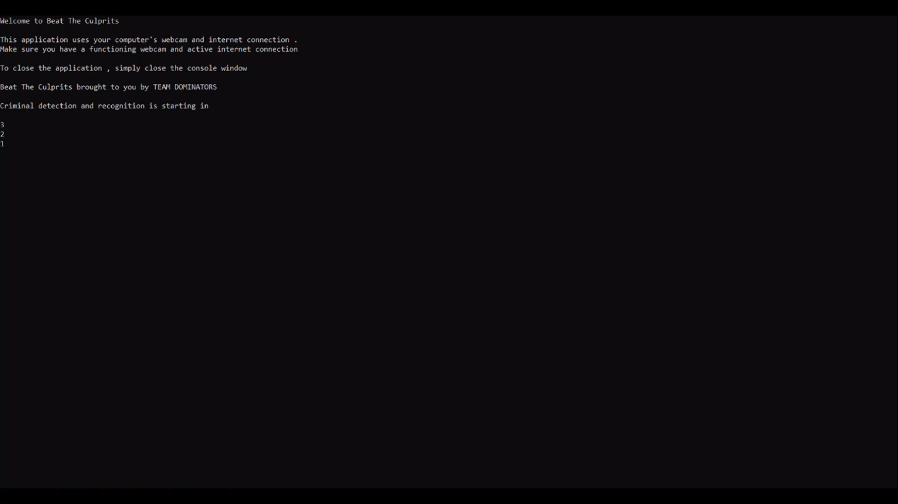
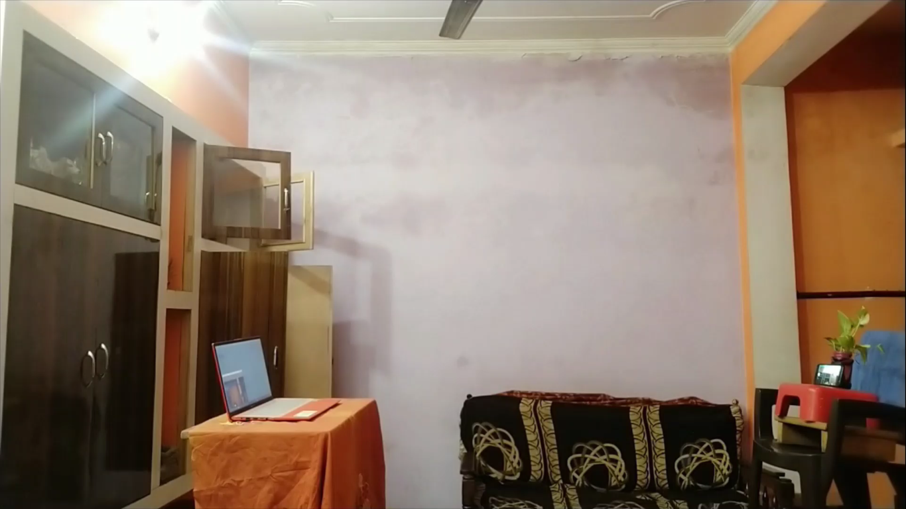
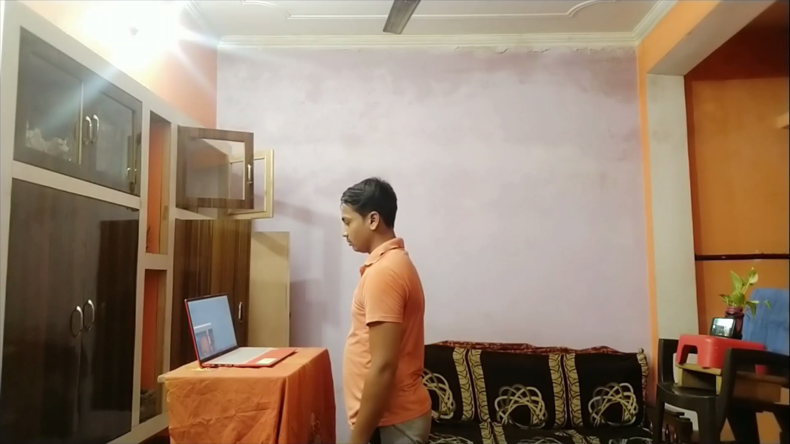
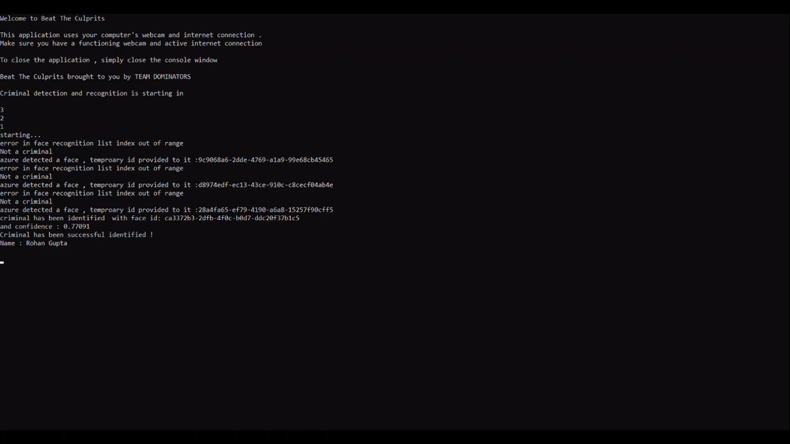
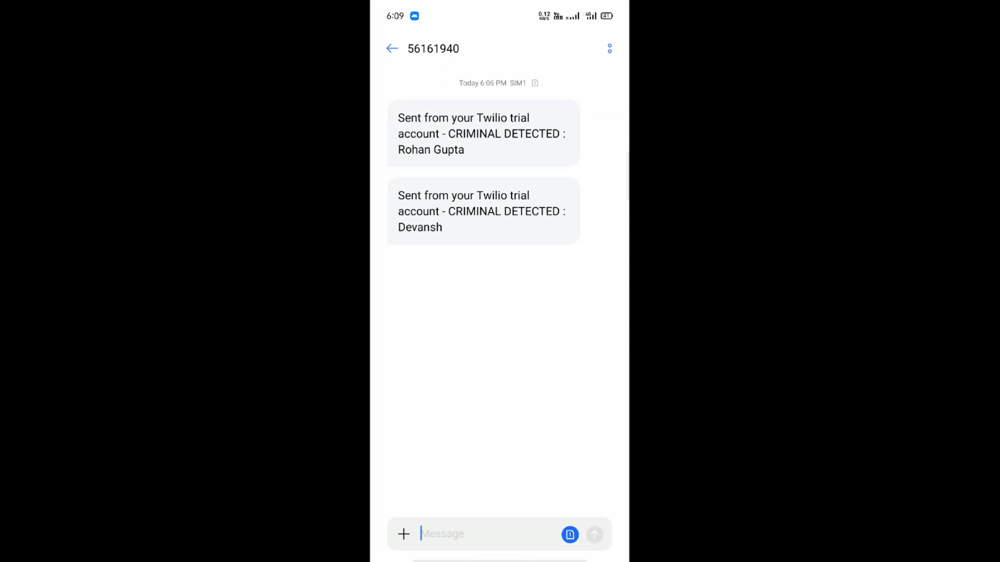

# Beat-THE-Culprit
Surveillance Cameras can <strong> detect </strong> and <strong> notify </strong> concerned authorities when a suspect pass through a queue when deployed at public places.
<h1> Algorithm:- </h1>

  Check Out the Algorithm :- <a href="https://github.com/thesurajkmr/Beat-THE-Culprit/blob/main/Beat%20The%20Culprit%20Algorithm.pdf">Click Here</a>

<h1>Process Walkthrough:-</h1>

1. Application Starts

2. Nobody is infront of the camera.

3. A Person designated as a criminal in the database appears infront of the camera.

4. The Person has been identified with 77 % Confidence and an alert has been sent to the authorities.

5. Alert Message on the receiving device.

